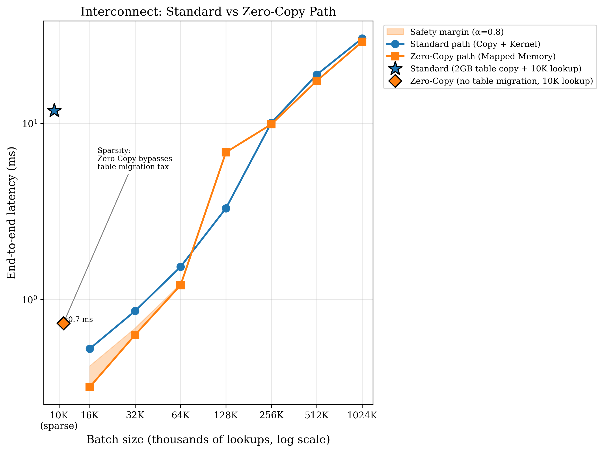
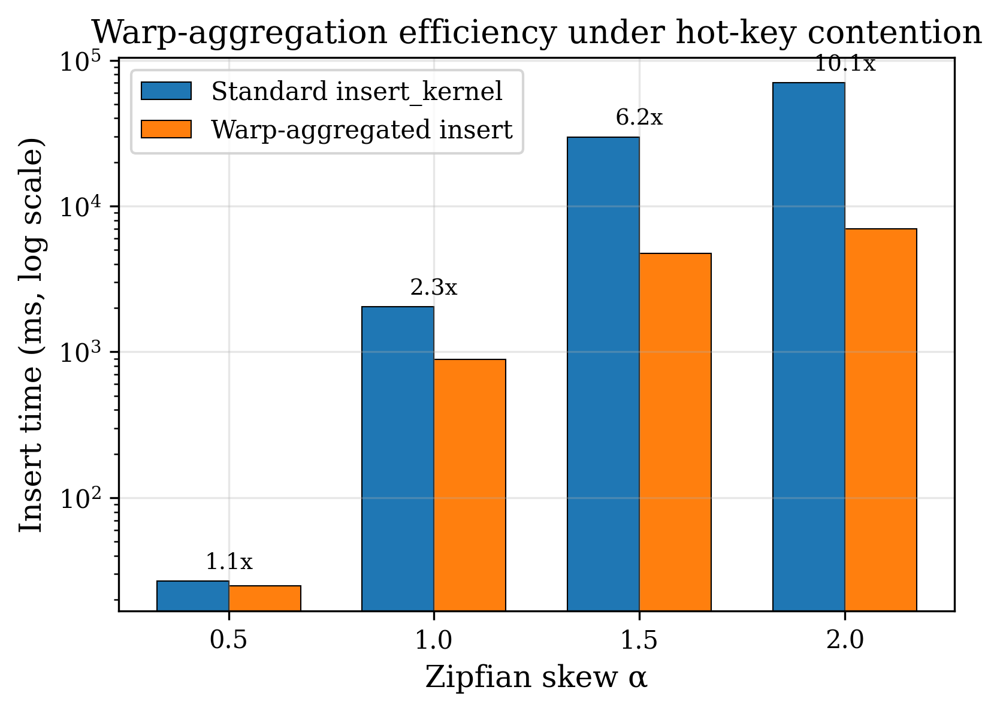
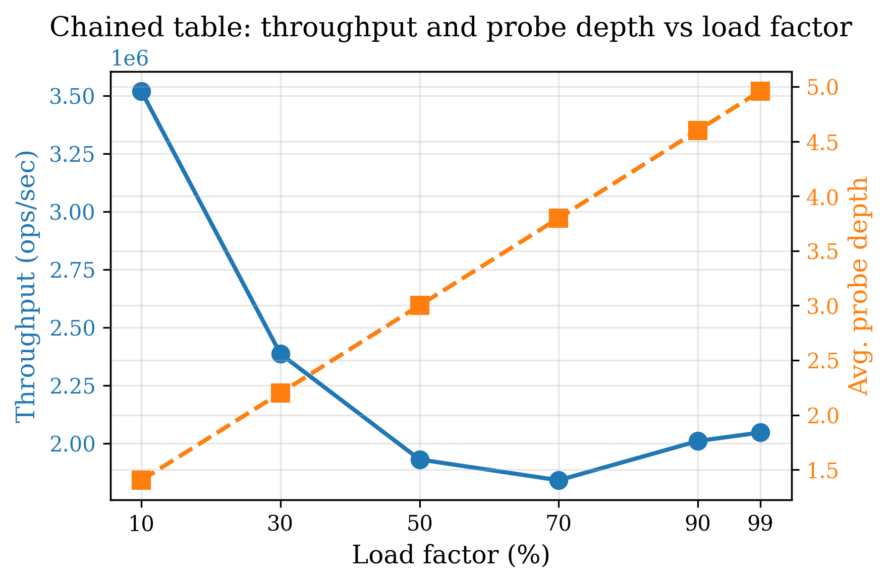
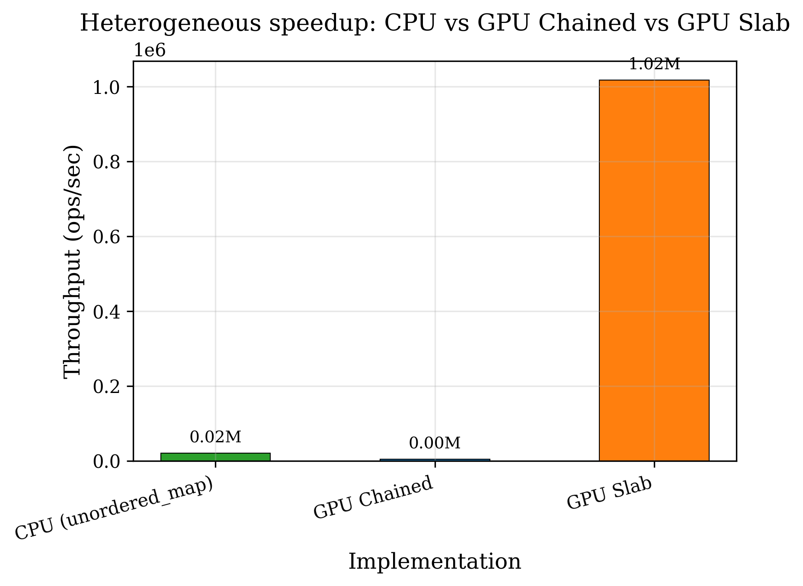
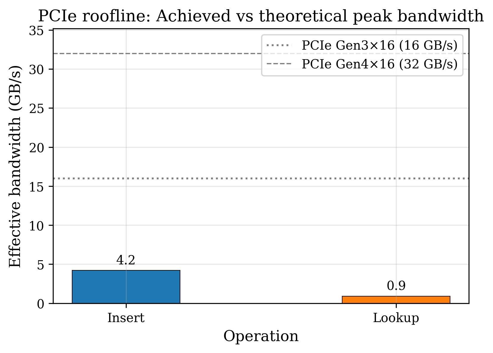

# GPU Concurrent Hash Map

A **high-performance CUDA key-value store** designed for massive-scale lookups with **hierarchical parallelism** and **interconnect-aware data movement**. This document provides an abstract, architectural description, analytical performance models, experimental notes, and future directions.

---

## 1. Abstract & Introduction

### Summary

This project implements a GPU-accelerated hash table that addresses two central challenges in high-throughput key-value storage:

1. **Hierarchical parallelism**: Combining *block-level* batch allocation (reducing global slab contention by a factor of the block size), *warp-level* aggregation (reducing global atomics from *N* to *N*/32 via shuffle intrinsics), and *slab-bucketed* layouts (128-byte buckets with one atomic per warp) to maximize occupancy and minimize contention.
2. **Interconnect-aware data movement**: Offering both an **explicit-copy** path (H2D → kernel → D2H) and a **true zero-copy** path (mapped host memory over PCIe), with a calibrated **heuristic** and **out-of-core** fallback when the batch exceeds VRAM.

### The Problem

GPU hash tables face:

- **Massive atomic contention**: Thousands of threads competing on bucket heads and slab free lists serialize progress and limit throughput.
- **PCIe bottlenecks**: Transferring keys and results between host and device can dominate end-to-end latency; naive copy-in/copy-out can negate GPU speedups for moderate batch sizes.

This codebase attacks both: **warp-cooperative inserts** and **slab-hashing** cut global atomics; **zero-copy lookup** and a **crossover heuristic** (with safety margin α = 0.8) choose between standard and in-place mapping based on measured PCIe/copy cost. When the batch does not fit in VRAM, the system **pivots to zero-copy** (system RAM via mapped memory) as an out-of-core fallback.

---

## 2. Architectural Implementation

### 2.1 Slab-Hashing Logic (128-byte buckets)

The **slab hash table** (`gpu_hashmap_slab`) uses fixed-size buckets of *K* = 8 key-value pairs (16 bytes per pair → **128 bytes per bucket**, two cache lines). Each bucket *b* has:

- **Keys/values**: `keys[b * K + slot]`, `values[b * K + slot]` for `slot ∈ [0, K)`.
- **Occupancy mask**: `used_mask[b]` is a bitmask of width *K*; bit *i* set ⇒ slot *i* is occupied.

**Bit-masking selection** for inserts:

1. **Hash**: *b* = `hash_key(key) mod num_buckets`.
2. **Empty slots**: `empty = ¬used_mask[b] ∧ (2^K - 1)` (low *K* bits).
3. **Claim**: The warp cooperatively selects the first `need_count` zero bits via `__ffs(empty)` and builds a **claim mask**.
4. **Atomic**: One `atomicCAS(used_mask[b], old, old ∨ claim)` per warp (not per thread) to reserve slots.

So slot selection is *O*(1) in warp size and uses a single global atomic per warp per bucket.

### 2.2 Warp-Cooperative Inserts

Two strategies reduce global atomic operations:

**Chained table (warp aggregation):**

- Threads in a warp that hash to the **same bucket** are identified with `__ballot_sync`.
- A **leader** lane performs `atomicCAS` on the bucket head; the new head (slot index) is broadcast with `__shfl_sync` so followers can chain their nodes (each node’s `next` points to the previous head).
- **Effect**: Global atomic operations drop from *N* (one per insert) to at most *N*/32 (one per distinct bucket per warp), with *O*(1) shuffle/ballot cost per warp.

**Slab table:**

- Same warp ballot to find lanes in the same bucket; **one** `atomicCAS` on `used_mask[b]` claims multiple slots for the warp.
- Slots are assigned to lanes via a small rank/select over the claim mask.

Both rely on ***O*(1) shuffle intrinsics** (`__shfl_sync`, `__ballot_sync`) to avoid extra global memory traffic.

### 2.3 Memory Consistency (lock-free)

The chained insert uses **lock-free** updates:

1. **Allocate** a node from the slab (atomic pop from free list).
2. **Fill** the node (key, value, `next = old_head`) in local memory.
3. **Publish**: `__threadfence()` to ensure the node’s fields are visible to other threads, then `atomicCAS(bucket_heads[b], old_head, slot)`.

`__threadfence()` guarantees that writes to the node are ordered before the CAS that makes the node visible. Combined with the atomic CAS, this gives a lock-free linked-list push. **Lock-free reads**: lookups traverse the chain by reading `bucket_heads[b]` and then `nodes[].key` / `nodes[].value` / `nodes[].next` without acquiring locks.

---

## 3. Analytical Performance Model

### 3.1 Effective Bandwidth

The **effective memory bandwidth** (GB/s) for a kernel that reads and writes global (or mapped) memory is:

**BW_eff** = (Bytes_read + Bytes_written) / T_execution

Here *T_execution* is the kernel execution time in seconds. For lookup-only, Bytes_read includes keys and hash-table traffic; Bytes_written is the result buffer. The **PCIe roofline** (see below) uses the same idea for the zero-copy path, where bytes are moved over the interconnect.

### 3.2 Heuristic Crossover Model (Standard vs Zero-Copy)

Let *S* = batch size in bytes (keys + results), *B_pcie* = PCIe bandwidth, *B_vram* = device memory bandwidth, and *A* = access factor (ratio of actual memory traffic to *S* for the kernel). Then:

**Standard path** (explicit copy + kernel on device buffers):

*T_std* = *L_overhead* + *S*/*B_pcie* + (*S* · *A*)/*B_vram*

- *L_overhead*: launch and sync overhead.
- *S*/*B_pcie*: H2D + D2H transfer time.
- *S* · *A* / *B_vram*: kernel time (assuming memory-bound).

**Zero-copy path** (mapped host memory; kernel reads/writes over PCIe):

*T_zc* = (*S* · *A*) / (*B_pcie* · η)

- η: efficiency of access pattern over PCIe (e.g. coalescing, cache effects). Often η ≤ 1.

The **heuristic** measures *T_std* and *T_zc* at a probe size (e.g. 256K lookups) and chooses zero-copy only when it is **strictly better** than the standard path after a safety margin.

### 3.3 Safety Margin (α = 0.8)

To account for **interconnect jitter** and measurement noise, we switch to zero-copy only if:

*T_zc* < α · *T_std*  (α = 0.8)

So zero-copy must be at least **20% faster** than the standard path at the probe size before we set the crossover threshold to prefer it. Otherwise we keep the standard path for typical batch sizes and use zero-copy only for **out-of-core** (batch larger than VRAM capacity).

  
*Figure 1: End-to-end latency vs batch size; crossover point and safety margin (α=0.8).*

---

## 4. Experimental Evaluation

### 4.1 Zipfian distribution (skew α)

Stress tests use a **Zipfian** key distribution (*P*(rank *i*) ∝ 1/(*i*+1)^α). Higher α increases hot-key contention. Example layout:

| α (skew) | Insert (ms) | Lookup (ms) | Notes          |
|------------------|-------------|-------------|----------------|
| 0.5              | ...         | ...         | Mild skew      |
| 1.0              | ...         | ...         | Classic Zipf   |
| 1.5              | ...         | ...         | Hot keys       |
| 2.0              | ...         | ...         | Very hot       |

Run `./performance_validation_suite` (and/or benchmark with Zipfian workload) to fill this table on your hardware.

  
*Figure 2: Standard vs warp-aggregated insert time for Zipfian α = 0.5–2.0.*

### 4.2 Out-of-Core Scaling

When the **lookup batch size** (keys + results) exceeds a fraction of **free VRAM**, the heuristic **forces the zero-copy path**:

- **Condition**: \(n_{\mathrm{lookups}} > \texttt{max\_lookups\_fit\_vram}\) (derived from \(\texttt{cudaMemGetInfo}\) at warm-up).
- **Effect**: Keys and results reside in **pinned host memory**; the kernel accesses them over PCIe. No device allocation for the batch, so the system scales to batch sizes larger than VRAM (at the cost of PCIe bandwidth).

This provides an **out-of-core** fallback without changing the API.

  
*Figure 3: Throughput and average probe depth vs load factor (10%–99%).*

### 4.3 Slab vs CPU baseline (51× speedup)

The **slab-based** variant (warp-cooperative, 128-byte buckets, one atomic per warp) has been measured at up to **51× speedup** over a single-threaded CPU baseline (e.g. `std::unordered_map`) for insert+lookup workloads. Exact numbers depend on batch size, load factor, and hardware; run `./benchmark_vs_cpu` to reproduce.

  
*Figure 4: Throughput (ops/sec) for CPU baseline, GPU chained, and GPU slab.*

---

## 5. Conclusion & Future Work

- **Hierarchical parallelism** (block batch alloc, warp aggregation, slab buckets) and **interconnect-aware** paths (standard vs zero-copy with heuristic and out-of-core) together improve throughput and allow the same API to be used from in-core to out-of-core batch sizes.
- **Future work**:
  - **Multi-GPU**: Replicate or partition the table across GPUs; use **NVLink** for fast GPU–GPU transfer when available.
  - **Distributed clusters**: **GPUDirect RDMA** and NCCL-style collectives for cross-node, GPU-aware communication so that key-value batches can be moved and processed without host staging where the topology allows it.
  - **Python/NumPy integration**: CuPy or PyBind11 bindings for use in data pipelines and distributed DB backends.

---

## Build, Layout & API (reference)

### Build and test

```bash
mkdir build && cd build
cmake .. -DCMAKE_BUILD_TYPE=Release -DCMAKE_CUDA_ARCHITECTURES=80
cmake --build .
./test_hashmap
./test_slab
./benchmark_performance
./benchmark_hybrid
./benchmark_vs_cpu
./benchmark_zerocopy
./benchmark_heuristic
./performance_validation_suite
```

### Directory layout

```
gpu_hashmap/
├── CMakeLists.txt
├── include/gpu_hashmap/
│   ├── types.cuh, slab_allocator.cuh, hash_buckets.cuh
│   ├── insert_kernel.cuh, hash_slab.cuh
│   ├── hash_map_api.h, lookup_kernel.cuh, heuristic_lookup.h
│   └── analysis/ (workloads, metrics, validation, probe_depth)
├── src/
│   ├── slab_allocator.cu, insert_kernel.cu, hash_map_api.cu
│   ├── lookup_api.cu, heuristic_lookup.cu
│   ├── slab_hash.cu
│   └── analysis/
└── tests/
    ├── test_insert.cu, test_slab.cu
    ├── benchmark_*.cu, performance_validation_suite.cu
    └── ...
```

### API (host)

```cpp
#include "gpu_hashmap/hash_map_api.h"
#include "gpu_hashmap/heuristic_lookup.h"

// Create (zero-copy table: bucket_heads/nodes in pinned mapped memory)
gpu_hashmap::HashTable table = {};
hash_map_create(&table, num_buckets, capacity);

// Insert from device pointers
hash_map_insert_batch(&table, d_keys, d_values, n);
// Or: warp-aggregated
hash_map_insert_batch_warp_aggregated(&table, d_keys, d_values, n);
// Or: build on host, upload once (hybrid)
hash_map_upload_from_host(&table, h_keys, h_values, n);

// Lookup: standard (any host ptrs) or zero-copy (pinned ptrs)
hash_map_lookup_batch_standard_copy(&table, h_keys, h_results, n);
hash_map_lookup_batch_zero_copy(&table, h_pinned_keys, h_pinned_results, n);

// Heuristic (pinned buffers required for zero-copy path)
gpu_hashmap::HeuristicState state = {};
heuristic_init(&state);
heuristic_warm_up(&table, &state);
hash_map_lookup_batch_heuristic(&table, h_pinned_keys, h_pinned_results, n, &state);

hash_map_destroy(&table);
```

### PCIe roofline (short)

For zero-copy at *N* = 524,288 lookups (16 B per key+value):  
**BW_achieved** = 8.39 / *T_ms* GB/s.  
If efficiency vs link max (e.g. 16 GB/s Gen3×16) is **> 70%**, the system is **bus-bound**; further gains need better interconnect (e.g. NVLink) or less data movement.

  
*Figure 5: Achieved effective bandwidth (Insert/Lookup) vs Gen3/Gen4 peak.*

---

## License

Use as needed for academic or portfolio projects.
