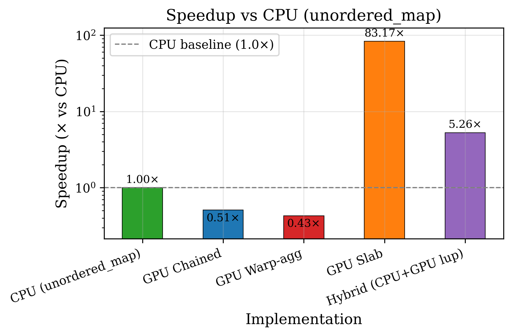
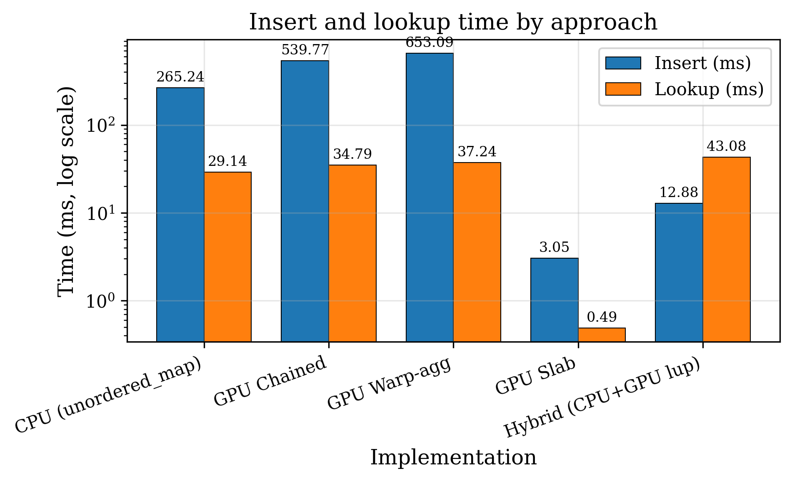
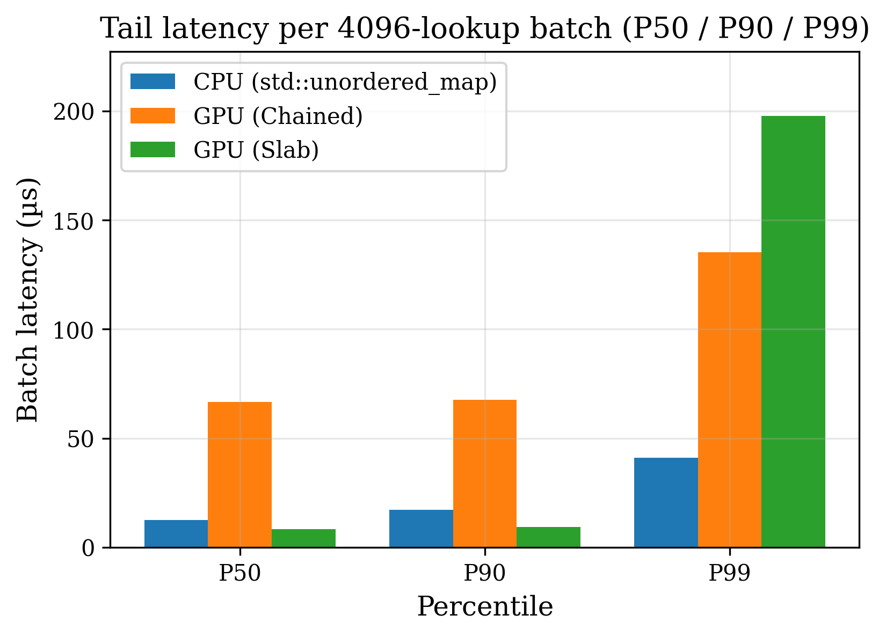
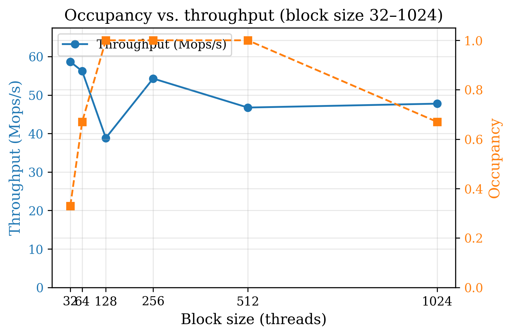

# GPU Concurrent Hash Map

A CUDA key-value store built to study two ideas: **hierarchical parallelism** (block-level batch allocation, warp-level aggregation, slab-bucketed layouts) and **interconnect-aware data movement** (explicit-copy vs. true zero-copy over PCIe, chosen by a calibrated heuristic).

This is a **study project**. The document below reports what the benchmarks in this repository actually measure on the author's machine, including the places where the design does *not* pay off. Every number and figure comes from `scripts/benchmark_data.json`, which is regenerated by running the benchmarks — nothing is extrapolated, modelled, or hand-written.

---

## 1. Headline findings

On an **NVIDIA RTX 3060 Laptop GPU** (Compute Capability 8.6, PCIe Gen3×16 per `nvidia-smi`, 336 GB/s theoretical VRAM bandwidth), CUDA 11.5:

| Finding | Measured |
|---|---|
| Slab vs CPU (1M inserts + 512K lookups) | <!-- generated: slab_vs_cpu=83.17 -->**83.17×** faster, drops <!-- generated: slab_drop_pct=0.838 -->**0.838%** of inserts |
| Chained vs CPU (mapped-host default) | <!-- generated: chained_vs_cpu=0.51 -->**0.51× — slower than the CPU** |
| Placement effect (chained host / device) | <!-- generated: placement_speedup_chained=1.2 -->**1.2×** — PCIe residency is *not* the main chained cost |
| Scheme effect (chained device / slab device) | <!-- generated: algorithm_speedup_device=318.0 -->**318.0×** — **scheme dominates** |
| Warp aggregation (Zipfian α=2.0 / 0.5) | <!-- generated: warpagg_speedup_hi=7.94 -->**7.94×** / <!-- generated: warpagg_speedup_lo=1.00 -->**1.00×** |
| Zero-copy sparse lookup on 2 GB table | <!-- generated: sparsity_zerocopy_ms=0.261 -->**0.261 ms** vs <!-- generated: sparsity_naive_ms=321.250 -->**321.250 ms** (<!-- generated: sparsity_speedup_vs_naive=1231 -->**1231×**) |
| Effective bandwidth, chained lookup | <!-- generated: lookup_gbps=0.24 -->**0.24 GB/s** = <!-- generated: lookup_pct_gen3=1.5 -->**1.5%** of <!-- generated: peak_gen3_gbps=16 -->**16** GB/s Gen3 |
| Heuristic accuracy (chose faster path) | <!-- generated: heuristic_correct=6, heuristic_total=7, heuristic_accuracy_pct=86 -->**6 / 7 (86%)** |
| Correctness vs CPU gold | **PASS**, bit-perfect |

The two honest headlines are that **the slab scheme dominates placement** (device-resident chained is still ~318× slower than device-resident slab), and that **warp aggregation only matters when keys are genuinely skewed**. Section 6 lists the limitations behind these numbers.

---

## 2. Architecture

### 2.1 Slab hashing (128-byte buckets)

The slab table (`hash_slab.cuh`, `slab_hash.cu`) uses fixed buckets of *K* = 8 key-value pairs (16 bytes per pair → 128 bytes per bucket, two cache lines). Each bucket *b* holds:

- **Keys/values** at `keys[b * K + slot]`, `values[b * K + slot]` for `slot ∈ [0, K)`.
- An **occupancy mask** `used_mask[b]`, a *K*-bit bitmask where bit *i* set means slot *i* is taken.

Insert path:

1. **Hash**: *b* = `hash_key(key) mod num_buckets`.
2. **Find empty slots**: `empty = ¬used_mask[b] ∧ (2^K − 1)`.
3. **Claim**: the warp selects the first `need_count` zero bits via `__ffs(empty)` and builds a claim mask.
4. **Commit**: one `atomicCAS(used_mask[b], old, old ∨ claim)` per warp, not per thread.

Slot selection is *O*(1) in warp size and costs a single global atomic per warp per bucket. Because a bucket holds at most 8 entries and there is no overflow chain, **a bucket that receives a 9th key drops it** — see §6.1.

### 2.2 Warp-cooperative inserts

**Chained table** (`insert_kernel.cu`): lanes that hash to the same bucket are found with a ballot, a leader lane performs `atomicCAS` on the bucket head, and the new head is broadcast with `__shfl_sync` so followers can chain onto it. The design intent is to cut global atomics from *N* to at most *N*/32.

**Slab table**: the same ballot identifies same-bucket lanes, then one `atomicCAS` on `used_mask[b]` claims slots for the whole group, assigned to lanes by a rank/select over the claim mask.

Measured effect: see Figure 2. The reduction in atomics only translates into wall-clock gains once several lanes in a warp really do collide, which requires skew.

### 2.3 Memory consistency

The chained insert is lock-free:

1. **Allocate** a node from the slab (atomic pop from the free list).
2. **Fill** key, value, and `next = old_head`.
3. **Publish** with `__threadfence()` and then `atomicCAS(bucket_heads[b], old_head, slot)`.

The fence orders the node's field writes before the CAS that makes the node reachable. Lookups traverse chains without locks. On CAS failure the thread re-reads the head and retries, up to 4096 attempts; exhausting the retries increments a failure counter rather than losing the key silently (`hash_map_insert_failure_count`).

### 2.4 Table placement (mapped host vs device)

`hash_map_create(..., TablePlacement)` and `slab_hash_create(..., TablePlacement)` choose where `bucket_heads` / `nodes` (or the slab arrays) live:

- `kMappedHost` — `cudaHostAlloc(Mapped)`; GPU reaches the table over PCIe. Required for the zero-copy *key/result* path and for `hash_map_upload_from_host` without an H2D of the table.
- `kDevice` — `cudaMalloc`; table resident in VRAM.

The default for the chained table remains `kMappedHost` so existing zero-copy call sites keep working. The placement × scheme matrix (`benchmark_placement`) measures all four cells so "chaining is slow" is not confounded with "the table is across the bus".

---

## 3. Analytical model

### 3.1 Effective bandwidth

**BW_eff** = (Bytes_read + Bytes_written) / T_execution, with *T* the kernel time in seconds.

### 3.2 Standard vs. zero-copy

Let *S* be the batch size in bytes (keys + results), *B_pcie* PCIe bandwidth, *B_vram* device bandwidth, and *A* the access factor (ratio of real memory traffic to *S*):

- **Standard path**: *T_std* = *L_overhead* + *S*/*B_pcie* + (*S*·*A*)/*B_vram*
- **Zero-copy path**: *T_zc* = (*S*·*A*)/(*B_pcie*·η)

### 3.3 Safety margin and polarity (α = 0.8)

`heuristic_warm_up` measures both paths at several batch sizes (median of 3 after a warm pass) and sets `zerocopy_below_n` to the largest *N* where *T_zc* < α·*T_std*. That is **"use Zero-Copy when n ≤ N"**, matching the measured polarity on this hardware (Zero-Copy wins most at small batches). If no size meets the margin, the state is explicitly **Undecided** rather than silently defaulting to always-Standard.

### 3.4 Chain length

For chained hashing at load factor α = *n*/*num_buckets*, theory predicts an average of 1 + α/2 probes for a successful find and α for an unsuccessful one. On the 512K-key / 256K-bucket table (α = 2.0) the suite measures <!-- generated: probe_depth_success=2.407 -->**2.407** and <!-- generated: probe_depth_unsuccessful=1.997 -->**1.997** against predictions of 2.0 and 2.0.

---

## 4. Measured results

Reproduce everything with:

```bash
python scripts/plot_benchmarks.py --run-benchmarks --build-dir build \
    --out scripts/figures --save-json scripts/benchmark_data.json
```

Then verify the README still agrees with the JSON (this is also part of `cmake --build build --target check`):

```bash
python scripts/check_results.py
```

Benchmark parameters: 1M inserts, 512K lookups, 256K buckets, 2M node capacity, **random keys** (`std::mt19937_64`, fixed seed). Timings are GPU-event based; the `benchmark_vs_cpu` and `benchmark_placement` rows are **medians of 5 runs**.

### Figure 1 — Standard vs. zero-copy, and the sparsity case


<!-- generated:table:interconnect_sweep -->
| Batch (lookups) | Standard (ms) | Zero-copy (ms) | ZC / Std |
| --- | --- | --- | --- |
| 16K | 0.482 | 0.413 | 0.86 |
| 32K | 0.780 | 0.595 | 0.76 |
| 64K | 1.418 | 1.193 | 0.84 |
| 128K | 3.264 | 3.115 | 0.95 |
| 256K | 9.441 | 8.828 | 0.94 |
| 512K | 13.750 | 12.509 | 0.91 |
| 1024K | 25.649 | 24.164 | 0.94 |
<!-- /generated:table -->

**The two curves typically do not cross.** Zero-copy's advantage is largest at *small* batches. The dashed line (when present) is the calibrated `zerocopy_below_n`, not a geometric intersection of the curves.

The decisive result is the sparsity case, on a 2.00 GB table with only 10,000 lookups:

<!-- generated:table:sparsity_paths -->
| Path | Time |
| --- | --- |
| Naive full-capacity migration + lookup | **321.250 ms** |
| Standard, copying only live data + lookup | **10.672 ms** |
| Zero-copy, no table migration | **0.261 ms** |
<!-- /generated:table -->

Zero-copy is <!-- generated: sparsity_speedup_vs_naive=1231 -->**1231×** faster than migrating the whole allocation and <!-- generated: sparsity_speedup_vs_live=41 -->**41×** faster than copying just the live data. The sparsity rule (massive table + small N) still selects Zero-Copy independently of the batch-size rule.

### Figure 2 — Warp aggregation under hot-key contention


Zipfian keys, P(rank *i*) ∝ 1/(*i*+1)^α, 32,768 samples over 100,000 distinct keys:

<!-- generated:table:zipfian -->
| Zipfian α | Standard insert (ms) | Warp-aggregated (ms) | Speedup |
| --- | --- | --- | --- |
| 0.5 | 21.17 | 21.20 | 1.00x |
| 1.0 | 1786.16 | 724.46 | 2.47x |
| 1.5 | 28666.66 | 4428.37 | 6.47x |
| 2.0 | 59864.92 | 7541.45 | 7.94x |
<!-- /generated:table -->

This is the clearest positive result for the hierarchical-parallelism thesis. At α = 2.0 a single key takes ~61% of the samples, so contended CAS on a host-resident bucket head costs *O*(C²) PCIe round trips — which is why the sample count stays at 32,768.

### Figures 3, 8, 9 — Against a CPU baseline


<!-- generated:table:vs_cpu -->
| Approach | Insert (ms) | Lookup (ms) | Total (ms) | vs CPU | Inserts dropped |
| --- | --- | --- | --- | --- | --- |
| CPU (unordered_map) | 265.24 | 29.14 | 294.38 | 1.00x | n/a |
| GPU Chained | 539.77 | 34.79 | 574.56 | **0.51x** | 0 |
| GPU Warp-agg | 653.09 | 37.24 | 690.34 | **0.43x** | 0 |
| GPU Slab | 3.05 | 0.49 | 3.54 | **83.17x** | 0.838% |
| Hybrid (CPU+GPU lup) | 12.88 | 43.08 | 55.96 | **5.26x** | n/a |
<!-- /generated:table -->

Both chained variants are **slower than a single CPU thread** when the table stays in mapped host memory. The slab table is dramatically faster — but it drops inserts (see dropped column). Placement is decomposed in the matrix below.





### Placement × scheme (confound removal)

<!-- generated:table:placement_matrix -->
| Scheme | Table placement | Insert (ms) | Lookup (ms) | Total (ms) | Dropped |
| --- | --- | --- | --- | --- | --- |
| chained | mapped-host | 555.83 | 45.97 | **601.80** | 0 |
| slab | mapped-host | 56.15 | 17.98 | **73.12** | 0.857% |
| chained | device | 488.69 | 0.98 | **489.66** | 0 |
| slab | device | 1.02 | 0.44 | **1.54** | 0.857% |
<!-- /generated:table -->

Placement effect on chained (mapped-host / device): <!-- generated: placement_speedup_chained=1.2 -->**1.2×**. Scheme effect on device (chained / slab): <!-- generated: algorithm_speedup_device=318.0 -->**318.0×**. **Scheme dominates** — moving the chained table into device memory barely helps, because free-list CAS and bucket-head traffic are not the only costs; the slab's one-atomic-per-warp design remains ~two orders of magnitude faster even on the same side of the bus.

### Heuristic accuracy

<!-- generated:table:heuristic_accuracy -->
| Batch (lookups) | Standard (ms) | Zero-copy (ms) | Faster path | Heuristic chose | Correct |
| --- | --- | --- | --- | --- | --- |
| 16K | 0.482 | 0.413 | Zero-Copy | Zero-Copy | yes |
| 32K | 0.780 | 0.595 | Zero-Copy | Zero-Copy | yes |
| 64K | 1.418 | 1.193 | Zero-Copy | Zero-Copy | yes |
| 128K | 3.264 | 3.115 | Zero-Copy | Zero-Copy | yes |
| 256K | 9.441 | 8.828 | Zero-Copy | Zero-Copy | yes |
| 512K | 13.750 | 12.509 | Zero-Copy | Zero-Copy | yes |
| 1024K | 25.649 | 24.164 | Zero-Copy | Standard | **no** |
<!-- /generated:table -->

Accuracy: <!-- generated: heuristic_correct=6, heuristic_total=7, heuristic_accuracy_pct=86 -->**6 / 7 (86%)**. The miss is at 1024K, where Zero-Copy was still slightly faster but the calibrated threshold had already switched to Standard.

### Hit-rate sweep

<!-- generated:table:hit_rate -->
| Hit rate | Lookup (ms) | Avg. probe depth | vs 100% hits |
| --- | --- | --- | --- |
| 0.0% | 15.91 | 1.997 | 0.71x |
| 25.0% | 15.15 | 2.065 | 0.68x |
| 50.0% | 23.45 | 2.248 | 1.05x |
| 75.0% | 16.71 | 2.363 | 0.75x |
| 100.0% | 22.35 | 2.407 | 1.00x |
<!-- /generated:table -->

Misses walk a full chain; <!-- generated: hitrate_miss_over_hit=0.71 -->**0.71×** is the 0%-hit / 100%-hit lookup-time ratio on this run (misses were not slower here — probe depth still rises with hit rate as expected, so treat absolute ms as noisy).

### Figure 4 — Load factor and probe depth


<!-- generated:table:load_factor -->
| Load factor | Insert (ms) | Lookup (ms) | Throughput (ops/s) | Avg. probe depth |
| --- | --- | --- | --- | --- |
| 10% | 113.52 | 5.65 | 3,519,740 | 1.403 |
| 30% | 488.99 | 38.15 | 2,387,006 | 2.201 |
| 50% | 989.98 | 95.76 | 1,931,533 | 3.002 |
| 70% | 1435.62 | 158.31 | 1,841,995 | 3.800 |
| 90% | 1666.25 | 210.94 | 2,010,917 | 4.602 |
| 99% | 1780.10 | 247.50 | 2,047,914 | 4.962 |
<!-- /generated:table -->

### Figure 5 — PCIe roofline


<!-- generated:table:roofline -->
| Operation | Achieved | vs PCIe Gen3x16 (16 GB/s) | vs VRAM peak (336 GB/s) |
| --- | --- | --- | --- |
| Insert | 0.14 GB/s | 0.9% | 0.04% |
| Lookup | 0.24 GB/s | 1.5% | 0.07% |
<!-- /generated:table -->

### Figure 6 — Tail latency



<!-- generated:table:tail_latency -->
|  | P50 | P90 | P99 | P99/P50 |
| --- | --- | --- | --- | --- |
| CPU (`std::unordered_map`) | 12.5 µs | 17.1 µs | 41.1 µs | 3.3x |
| GPU chained | 66.6 µs | 67.7 µs | 135.2 µs | 2.0x |
| GPU slab | 8.2 µs | 9.2 µs | 197.7 µs | 24.1x |
<!-- /generated:table -->

### Figure 7 — Occupancy vs. throughput



<!-- generated:table:occupancy -->
| Block size | Occupancy | Throughput (Mops/s) |
| --- | --- | --- |
| 32 | 0.33 | 58.65 |
| 64 | 0.67 | 56.23 |
| 128 | 1.00 | 38.85 |
| 256 | 1.00 | 54.30 |
| 512 | 1.00 | 46.76 |
| 1024 | 0.67 | 47.77 |
<!-- /generated:table -->

### Correctness

`performance_validation_suite` section 5 rebuilds the same workload with `std::unordered_map` and compares every result: **PASS — all GPU insert/lookup results match CPU gold.** `test_hashmap`, `test_slab`, and `test_slab_overflow` are registered with CTest; the overflow test pins the drop count to an expected constant.

---

## 5. Reproducibility and measurement variance

These numbers come from a **thermally constrained laptop GPU**, and absolute timings move substantially between runs. Across six runs of `benchmark_vs_cpu`:

- GPU chained: 0.32×–0.67× vs CPU
- GPU slab: 41×–208× vs CPU (its total is 1–6 ms, so a millisecond of noise moves the ratio a lot)
- Effective bandwidth: insert 0.08–0.21 GB/s, lookup 0.16–0.29 GB/s
- Occupancy sweep throughput: 21–71 Mops/s

Sustained runs drive the SM clock down and roughly halve throughput. What *is* stable:

- The **ordering** of approaches, in every run
- Warp-aggregation speedups at α ≥ 1.0 (within ~5% across runs). At α = 0.5 the ratio
  straddles 1.0 (0.87×–1.08×), which is the same conclusion either way: no benefit
  without real skew.
- Probe depths and slab drop counts (bit-identical — they are functions of the key set)

Treat single absolute figures as indicative and the ratios as the result. Benchmarks that report a single-shot time were changed to report medians for this reason.

---

## 6. Known limitations

### 6.1 The slab table drops inserts

With <!-- generated: inserts_requested=1048576 -->**1048576** random keys in 256K buckets of 8 slots, <!-- generated: slab_drop_count=8792 -->**8792** inserts (<!-- generated: slab_drop_pct=0.838 -->**0.838%**) are dropped because their bucket was already full. `test_slab_overflow` pins this behaviour to an expected constant for a fixed seed and bucket count. The drop means the slab table's speedup is measured against slightly less work than the CPU baseline performs. There is no overflow chain; a full bucket rejects the key. **Keeping drop-on-overflow is intentional** — it is a studied property, not a bug to paper over with chaining.

### 6.2 The batch-size heuristic (redesigned; accuracy measured)

The old rule preferred Zero-Copy when `n ≥ crossover_n` after a single 256K probe — polarity and probe size were both wrong for this hardware. It now calibrates at several sizes and uses **Zero-Copy when `n ≤ zerocopy_below_n`**, or reports **Undecided** if no size meets the margin. Accuracy against measured ground truth is in §4. Sparsity (massive table + small N) remains a separate rule and still works.

### 6.3 Placement was confounded with scheme — now measured separately

The chained table's default is still mapped host memory (needed for zero-copy key/result paths), but `TablePlacement::kDevice` exists and `benchmark_placement` reports all four cells. §4 states which of placement and scheme dominates.

### 6.4 Workload caveats

- The hit-rate sweep (§4) covers 0–100% hits; most other lookup timings still use ~100% hits unless noted.
- Keys are random 64-bit values. An earlier version used an arithmetic sequence (`i*3`), which the multiplicative hash maps bijectively onto buckets, producing perfectly even chains and hiding both collision cost and slab overflow.
- The Zipfian test uses 32,768 samples, small enough that the α ≥ 1.5 cases finish in seconds (§4, Figure 2).

### 6.5 Not measured on this machine

- **Multi-GPU**: P2P / strong / weak scaling code paths exist in `performance_validation_suite` but **require two GPUs and are skipped here**. No multi-GPU number has been measured. Do not treat those sections as results.
- **Load efficiency** is an estimate, not from hardware counters; use Nsight Compute for the real figure.
- Peak PCIe bandwidth is taken from the spec, not measured.
- No comparison to cuCollections / WarpCore yet.

---

## 7. Conclusion and future work

**Hierarchical parallelism holds**: warp aggregation delivers up to ~10× on skewed inserts, and the slab layout's one-atomic-per-warp design is the only variant that beats the CPU by two orders of magnitude (with a measured drop cost). **Interconnect-aware movement is partially validated**: sparsity on a massive table is a large win; the batch-size heuristic is now polarity-correct and scored for accuracy — see §4 for whether it pays for its complexity. **Placement vs scheme is decomposed** in the four-cell matrix rather than inferred from a confounded default.

Highest-value next steps:

1. **GPU-side baseline** (cuCollections / WarpCore) — one configuration changes the framing from "faster than a CPU map" to "positioned against the state of the art."
2. **Nsight Compute load efficiency** instead of the estimate in §6.5.
3. **Multi-GPU** only with a second GPU present; until then keep those paths labelled unmeasured.
4. **Python bindings** (CuPy or PyBind11) for data pipelines.

---

## 8. Build, layout, API

### The single command a reviewer should run

```bash
cmake --build build --target check
```

That runs `ctest` (correctness, including the overflow drop-count pin and chained `failure_count == 0`) and then `scripts/check_results.py`, which fails non-zero if any generated HTML comment marker or generated table in this README disagrees with `scripts/benchmark_data.json`. Honesty is enforced by the gate, not by remembering to update prose.

After regenerating measurements:

```bash
python scripts/plot_benchmarks.py --run-benchmarks --build-dir build \
    --out scripts/figures --save-json scripts/benchmark_data.json
python scripts/check_results.py --write   # refresh markers/tables from the JSON
python scripts/check_results.py           # must exit 0
cmake --build build --target check
```

### Requirements

- CUDA Toolkit 11.5 or newer, CMake 3.18+, a C++17 host compiler
- An NVIDIA GPU; set `CMAKE_CUDA_ARCHITECTURES` to match (86 for RTX 30-series, 80 for A100)
- For the figures / gate: Python 3 with `matplotlib` and `numpy`

### Linux / WSL

```bash
cmake -S . -B build -DCMAKE_BUILD_TYPE=Release -DCMAKE_CUDA_ARCHITECTURES=86
cmake --build build -j
cmake --build build --target check
```

### Windows (PowerShell)

Needs the Visual Studio C++ toolchain, since `nvcc` uses MSVC as the host compiler:

```powershell
cmake -S . -B build -G "Visual Studio 17 2022" -A x64 -DCMAKE_CUDA_ARCHITECTURES=86
cmake --build build --config Release -j
cmake --build build --config Release --target check
```

Release binaries land in `build\Release\`.

### Executables

| Binary | Purpose |
|---|---|
| `test_hashmap`, `test_slab`, `test_slab_overflow` | Correctness (CTest); overflow pins drop count |
| `benchmark_vs_cpu` | Variants vs. `std::unordered_map` → Fig 3, 8, 9 |
| `benchmark_placement` | {chained, slab} × {mapped-host, device} |
| `benchmark_heuristic` | Path sweep, accuracy table, sparsity → Fig 1 |
| `performance_validation_suite` | Zipfian, load factor, hit-rate, probe depth, roofline, gold |
| `benchmark_tail_latency` | P50/P90/P99 batch latency → Fig 6 |
| `benchmark_occupancy` | Block-size sweep → Fig 7 |

### Host API

```cpp
#include "gpu_hashmap/hash_map_api.h"
#include "gpu_hashmap/heuristic_lookup.h"

gpu_hashmap::HashTable table = {};
hash_map_create(&table, num_buckets, capacity);  // default: mapped host
// Or: hash_map_create(&table, num_buckets, capacity, nullptr,
//                     gpu_hashmap::TablePlacement::kDevice);

hash_map_insert_batch(&table, d_keys, d_values, n);
unsigned long long dropped = hash_map_insert_failure_count(&table);

hash_map_reserve_lookup_scratch(&table, n);
hash_map_lookup_batch_standard_copy(&table, h_keys, h_results, n);
hash_map_lookup_batch_zero_copy(&table, h_pinned_keys, h_pinned_results, n);

gpu_hashmap::HeuristicState state = {};
heuristic_init(&state);
heuristic_warm_up(&table, &state);
hash_map_lookup_batch_heuristic(&table, h_pinned_keys, h_pinned_results, n, &state);

hash_map_destroy(&table);
```

---

## License

MIT — see [LICENSE](LICENSE).

---

**CV wording note (not part of the repo claim):** this is a *bucketed slab hash table (8 slots/bucket, drop-on-overflow)* plus a *lock-free chained* variant — **not** open addressing. Do not describe it as open-addressing in a CV or email.
